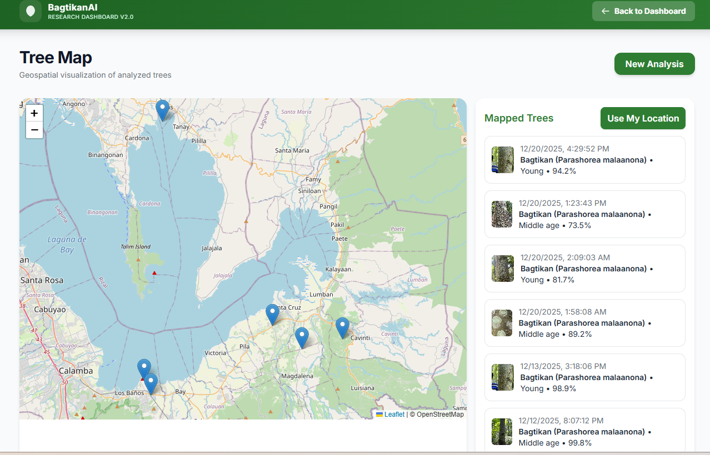
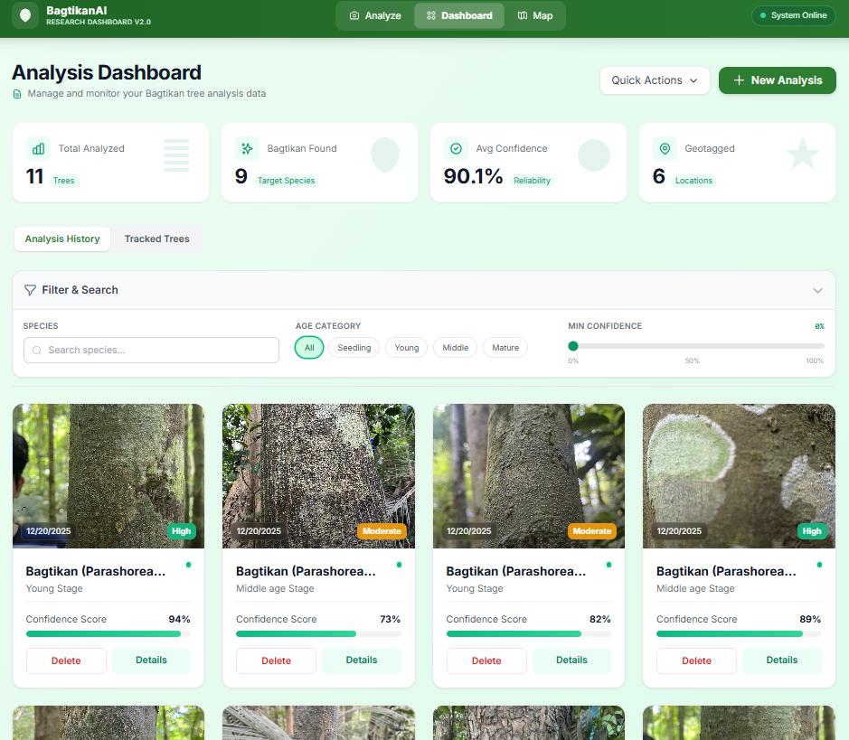
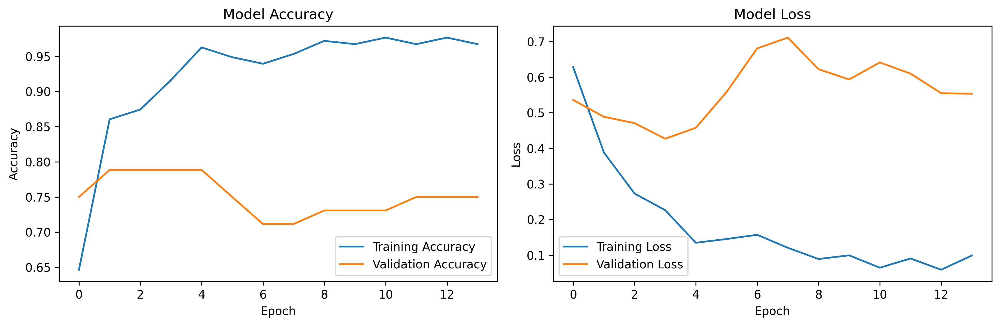
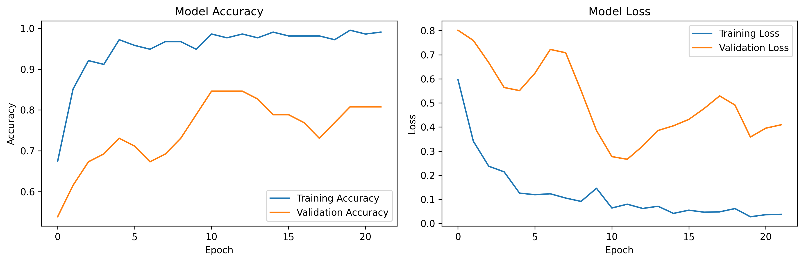

# 🌳 Non-Invasive Age Estimation of *Parashorea malaanonan* Using Machine Learning

This project focuses on the **non-invasive estimation of tree age** for *Parashorea malaanonan* (locally known as **Bagtikan**), a dipterocarp species native to the Philippines.  
Using **machine learning techniques**, the system predicts tree age based on measurable attributes such as **Diameter at Breast Height (DBH)**, avoiding destructive sampling methods.
https://media4.giphy.com/media/v1.Y2lkPTc5MGI3NjExaGh3Z2NvaDV2Y3czemt3eTQ4cXltNWEwd2U3Y2w4NzgzOTVhdnF6ZyZlcD12MV9pbnRlcm5hbF9naWZfYnlfaWQmY3Q9Zw/YBMbSgcgkcnAc/giphy.gif
---

## 📌 Project Objectives

- Develop a **machine learning-based age estimation model** for *Parashorea malaanonan*
- Utilize **non-invasive tree measurements** (e.g., DBH)
- Provide an interpretable and reproducible workflow for forestry and environmental research
- Support sustainable forest management and conservation efforts

---
## 🖼️ Screenshots and Visual Results

### 🌳 Study Area / Reference

### 🌿 Sample Tree / Reference Image

### 📈 Model Training and Evaluation

#### Training Plot – Experiment 1

#### Training Plot – Experiment 2

ZIP File: https://drive.google.com/file/d/1kse84M021DFJuI5D_RnL0HjwevVmA4OK/view?usp=drive_link

